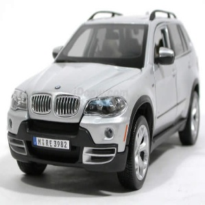
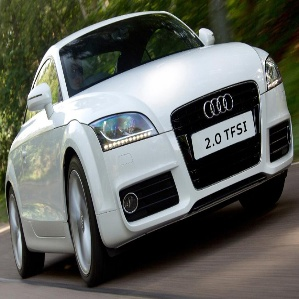
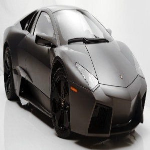

## Stanford Car Classification
A image classification program that uses Google's Machine Learning library, Tensorflow and a pre-trained Deep Learning Convolutional Neural Network model called Inception V3.

This model has been pre-trained for the ImageNet Large Visual Recognition Challenge using the data from 2012, and it can differentiate between 1,000 different classes, like Dalmatian, dishwasher etc. The program applies Transfer Learning to this existing model and re-trains it to classify a new set of images.

## Dependencies

- [NumPy](http://docs.scipy.org/doc/numpy-1.10.1/user/install.html)
- [Tensorflow](https://www.tensorflow.org/versions/r0.8/get_started/os_setup.html)
- [Keras](https://keras.io/#installation)
- [OpenCV](https://opencv-python-tutroals.readthedocs.io/en/latest/)
- [Scipy](https://www.scipy.org/)

## Dataset
We use the Cars Dataset, which contains 16,185 images of 196 classes of cars. The data is split into 8,144 training images and 8,041 testing images, where each class has been split roughly in a 50-50 split.

You can get it from [Cars Dataset](https://ai.stanford.edu/~jkrause/cars/car_dataset.html):

```bash
$ cd Car-Recognition
$ wget http://imagenet.stanford.edu/internal/car196/cars_train.tgz
$ wget http://imagenet.stanford.edu/internal/car196/cars_test.tgz
$ wget --no-check-certificate https://ai.stanford.edu/~jkrause/cars/car_devkit.tgz
```

# Pre-Processing Image
-add cars_train, cars_test and car_devkit files to this folder

```bash
 python pre-process.py 
```
- To split train dataset by train/valid/test
- We augmented the color of each images to generate 2 more images. 
- This is done to increase the number of train dataset for each class.
- Each original image was converted to from RGB to BGR and BGR to HSV respectively.

# Train Dataset
```bash
python train.py \
  --bottleneck_dir=logs/bottlenecks \
  --how_many_training_steps=100000 \
  --model_dir=inception \
  --summaries_dir=logs/training_summaries/basic \
  --output_graph=logs/trained_graph.pb \
  --output_labels=logs/trained_labels.txt \
  --image_dir=./data/train
```
- to train the dataset
- the inception model file will be dowloaded once the code runs
- images are augmented in different distortions like crops, scales, and flips.

# Test Dataset
download trained model files here and save to **logs** folder of the main directory
https://drive.google.com/drive/folders/1UJFZ4DdFAVerVFvLWqbtFE7tMInd51Ir?usp=sharing
```bash
python classify.py path/to/image 
```
- to test single image 

#### Test acc:
**62.34%**
- The more complex model (ex. InceptionV3) the less accurate results are. This is understanable due to bias/variance problem.

# Results
- Results of images from test dataset
- The final results display confidence score for all cars from highest to lowest


<br />
BMW X3 SUV 2012 (score = 0.60578)
<br />
Bentley Continental Flying Spur Sedan 2007 (score = 0.02981)
<br />
BMW X5 SUV 2007 (score = 0.02563)
<br />
Mercedes-Benz E-Class Sedan 2012 (score = 0.02369)
<br />
Audi V8 Sedan 1994 (score = 0.02163)
<br />
BMW 3 Series Sedan 2012 (score = 0.01933)
<br />
Audi S6 Sedan 2011 (score = 0.01916)
<br />
<br />

<br />
Audi TT Hatchback 2011 (score = 0.41686)
<br />
Audi R8 Coupe 2012 (score = 0.08508)
<br />
Audi TT RS Coupe 2012 (score = 0.08176)
<br />
Jaguar XK XKR 2012 (score = 0.07689)
<br />
Bentley Continental GT Coupe 2007 (score = 0.04783)
<br />
Porsche Panamera Sedan 2012 (score = 0.02808)
<br />
Bentley Continental Supersports Conv. Convertible 2012 (score = 0.01938)
<br />
<br />

<br />
Lamborghini Reventon Coupe 2008 (score = 0.95508)
<br />
Fisker Karma Sedan 2012 (score = 0.01009)
<br />
Ford GT Coupe 2006 (score = 0.00693)
<br />
Lamborghini Aventador Coupe 2012 (score = 0.00500)
<br />
Ferrari FF Coupe 2012 (score = 0.00405)
<br />
Bugatti Veyron 16.4 Coupe 2009 (score = 0.00378)
<br />
Chevrolet Corvette ZR1 2012 (score = 0.00233)
<br />
<br />

<br />
Porsche Panamera Sedan 2012 (score = 0.21820)
<br />
Ford GT Coupe 2006 (score = 0.16311)
<br />
Jaguar XK XKR 2012 (score = 0.09361)
<br />
Hyundai Veloster Hatchback 2012 (score = 0.05442)
<br />
Eagle Talon Hatchback 1998 (score = 0.04111)
<br />
Aston Martin Virage Coupe 2012 (score = 0.03734)
<br />
Bugatti Veyron 16.4 Coupe 2009 (score = 0.03222)
<br />


